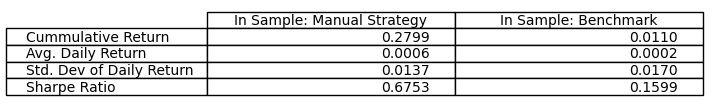

## Project Overview

In this project, we will make use of 3 technical indicators to build two types of strategies for trading. The first is a manual strategy based on a set of rules and indicators, and the second is an algorithm that learns and predicts trade signals from the same indicators. 

## Strategies

The first strategy is a manual strategy that makes use of three technical indicators and a set of rules to determine when to buy/sell a stock. For any given day, in the manual strategy, each indicator will "vote" on to what to do, based on the rules, and the final action will be what the most popular vote it. In case of a 3-way tie between buy, sell and do nothing, we will do nothing.

The second strategy makes use of a learning algorithm to predict when to buy or sell, based on the same set of indicators. More specifically, the learner will make use of decision trees and random forests (DTLearner and BagLearner). We will later go into more details into the strategies themselves and the logistics involved, but first, let's introduce the indicators that we will use.

## Technical Indicators

### Simple Moving Average

An SMA, or Simple Moving Average, reflects the average price of a stock over a certain period of time. For example, if we wanted an SMA of 50 days, we would need to look at our stock over a period of at least 50 days. The first 50 data points of our SMA will be null, since, up to day 50, we don't have any prior 50 day period to look back to. After the 50th day, each data point is the average of price over the previous 50 days.

We will use price crossover to generate buy/sell signals from SMA - in other words, we will look at deviations in the SMA and price on a given date to determine whether to buy or sell the stock. More specifically, we will look at the price to SMA ratio, and if the ratio is less than 60%, we will then buy the stock, and if it is greater than 100%, we will sell the stock. The exact percentages were fine tuned on training data.

### % Bollinger Bands

There are 3 components to the BB of a stock; the SMA over a given window *M*, the rolling upper standard deviation and rolling lower deviation. The rolling standard deviation at a given time *t*, is simply the standard deviation of the price over a given window *M* before *t*.

Many believe that if the price crosses the upper band, then the security is overbought and indicates a sell signal. Similarly, if it crosses the lower band, it indicates a buy signal. The reason this works is because by crossing one of the upper and lower band, the price is largely deviating from the mean. Following the theory of mean reversion, we then expect the price to go back the opposite direction, towards the mean. We can formalize this rationale with the Percentage Bollinger Bands or %BB. This indicator is simply an index representing the relationship between the price, SMA and rolling standard deviation of a security. If index crosses +1 or +100%, this would be indicative of a sell signal, and similarly, if it crosses the -1 or -100% mark, it is indicative of a buy signal.

### MACD

MACD makes use of EMAs, or exponential moving averages, to generate buy or sell signal. Simply put, to generate these signals, there are four components that are needed. The first two are two EMAs of varying windows - typically on short and one long. The next two components consist of MACD and the EMA of the MACD generated, also referred to as the signal. MACD in itself is simply the difference between the two EMAs. Once we have MACD, we can calculate its EMA to obtain the signal. The indicators from MACD are fairly straightforward - a signal to MACD ratio greater than 1 indicates a buy signal, and a ratio less than 1 indicates a sell signal.

## Manual Strategy

Our manual strategy relies on the three indicators we have identified above. For a given period of time, for every trading day, we will determine whether there is a buy, sell or do nothing signal (each numerically represented by a 1, -1, and 0.) We will let each individual indicator vote on what we should do on a given day, and use a popular vote approach to determine our action. That is to say that we will perform the most popular action as indicated by the votes, i.e., if 2 out of the three indicators have a buy signal, we will buy even if the third one has a sell signal.

This strategy ended up working quite well, especially compared to the alternative of unanimous vote. Unanimous vote resulted in very infrequent trades, and were not as profitable as our current strategy. Presumably, this was because some indicators had different sensitivity to some patterns in trades. Note that the project requires trading a total of 1000 shares of JPM stock, which in turns implies we can have between 2000 and -2000 shares at any given point in time, depending on whether we are long or short.

### In-Sample Evaluation

In the chart below, we can observe the results on of manual strategy on in-sample data, compared against a benchmark strategy. The benchmark strategy simply consists of buying 1000 shares on the opening day of the time period, and holding them throughout. Note that in the chart below, we have normalized the value of our portfolios. Each vertical blue line on the chart represents a long entry from our manual strategy, and the black ones a short entry.

As we can clearly see, our manual strategy vastly outperforms the benchmark. Our manual strategy has a total cumulative return of about 30\% while the benchmark's return is close to 0.

###Out-of-Sample Evaluation

We can also compare the performance of the two strategies above on out of sample data.

As we can see from the figure above, while our manual strategy slightly outperforms the benchmark with the out of sample data, the difference is not nearly as noticeable as with the in-sample data. We can see that our manual strategy lagged behind early on with a poor short entry, between January and April 2010. The manual strategy eventually catches up, but is unable to marginally overcome the big, early setback.

### Comparison

Similarly to the visual results above, we can see that the metrics for the manual strategy far outperform the benchmark in the in sample case. We have a higher total return and higher average daily return, while also having less volatility and a higher sharpe ratio. Conversely, the metrics on the out-of-sample data are only very slightly better. We see a higher total return compared to the benchmark, albeit both are negative, and the manual strategy has a better return on risk.

Again, as mentioned above, the main reason behind the in-sample and out-of-sample performance of our manual strategy is a poor call on the out sample data. We see a short entry decision as the stock is climbing up. While the strategy eventually catches up, it fails to climb out of the large hole it dug itself into. This is not unexpected - technical indicators are never perfect, and using a popularity voting system does leave the strategy more open to risk.

## Strategy Learner

The strategy learner makes use of the same indicators that we highlighted above. However, since this is a learning problem, we have to frame the problem differently.

The first part is thinking about any data manipulations. If the algorithm for the strategy learner were a Q-learning algorithm, we would have needed to discretize the data and create a state space representation. Although helpful and more straightforward, discretization is not necessary for Q-learning. A possible alleyway is to use a Deep Q-Network, which makes use of a Neural Network to help interpret a continuous state space.

However, in our case, we will not go the Reinforcement Learning way, but instead the supervised learning way using a BagLearner and DTLearner. These do no require any discretization as this is a simple learning problem, needing a dependent and independent variable. Note that we slightly modified the BagLearner and DTLearner implemented in earlier projects to become classifiers as opposed to regressors, by changing the mean to a mode.

We do, however, need to create a dependent variable, as our indicators will be used as independent variables. That is to say that we need to create a variable that indicates buy/sell/do nothing signals (1,-1,0.) To do so, we will do a 10-day look ahead at stock price. If the look ahead price is lower than the current price, we will short the stock, if it is higher, we will go long on the stock. With this process, we can create a 1-dimensional vector that indicates on every given day, what we should do. We want our learner to learn patterns in the data (the value of the indicators) that would help predict buy/sell signals (the 1-d vector.)

Once our learner has done so, we will test it on new data to see if these patterns allow for a good generalization on new data. This part is particularly important, because as we tune our learner, we want to ensure that we do not overfit the training data. 

## Manual v/s Strategy Learner

Let's contrast and compare the performance of our manual and strategy learner, with our benchmark on in-sample data. This is very similar to what we did in Figure 1, but without the entries, and with the addition of the strategy learner. Our hypothesis is that the strategy learner will outperform both the manual strategy and benchmark. The three performances are displayed on the chart below.

As we saw earlier, our manual strategy outperformed our benchmark on in-sample data. The addition to this experiment was the strategy learner. It is clear that the latter outperforms both the manual and benchmark, thus provin our hypothesis right. This is not surprising, as this is the same dataset that our learner has been trained on. There is likely a small degree of overfit which will result in a good performance on the in-sample data.